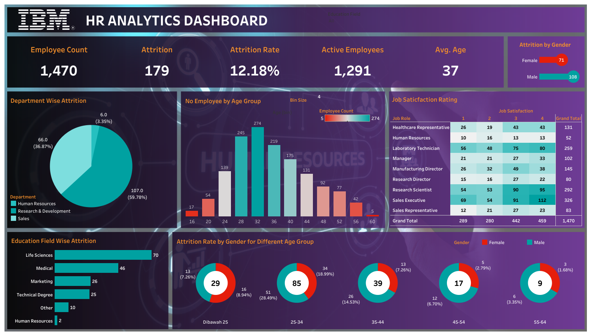

# Proyek Akhir: Menyelesaikan Permasalahan Atrisi Karyawan Pada Perusahaan IBM

## Business Understanding

IBM mengalami tantangan dalam mengelola dan mempertahankan karyawan secara efektif. Memahami atrisi (pergantian karyawan) dan metrik kinerja sangat
penting untuk meningkatkan kepuasan dan produktivitas tenaga kerja. Atrisi karyawan (Attriction Employee) dapat menyebabkan biaya yang besar dan berdampak
pada kinerja tim.

### Permasalahan Bisnis

1. Mengidentifikasi faktor-faktor yang mempengaruhi attrition rate dalam perusahaan.
2. Memahami distribusi attrition berdasarkan departemen, usia karyawan, dan pendidikan.
3. Menilai kepuasan karyawan berdasarkan peran pekerjaan (job satisfaction rating).
4. Menganalisis distribusi dan tren attrition berdasarkan gender dan kelompok usia.

### Cakupan Proyek

- Mengolah dan menganalisis dataset IBM HR Analytics Employee Attrition & Performance dari Kaggle.
- Membuat visualisasi dashboard HR Analytics yang berfokus pada:
  - Employee count, attrition rate, dan profil demografis.
  - Analisis departemen dan bidang pendidikan terkait tingkat attrition.
  - Distribusi employee attrition berdasarkan gender dan umur.
  - Rating kepuasan karyawan berdasarkan peran pekerjaan.
- Memberikan rekomendasi untuk mengurangi tingkat attrition.

### Persiapan

Sumber data: [employee_data.csv](https://github.com/dicodingacademy/dicoding_dataset/blob/main/employee/employee_data.csv)

Setup environment:
Tools yang digunakan:

- Tableau untuk membuat Dashboard.
- Google Colab untuk menjalankan notebook.ipynb
- Python untuk membuat model Machine Learning.
- Dataset employee_data.csv

install pustaka (library) berikut:

```
pip install -r requirements.txt
```

## Business Dashboard

Link HR Analytics Tableau Public Dashboard : [HR Analytics Dashboard](https://public.tableau.com/views/WatsonsHRAnalyticsDashboard/IBMHRAnalyticsDashboard?:language=en-US&publish=yes&:sid=&:redirect=auth&:display_count=n&:origin=viz_share_link)

Dashboard ini menampilkan berbagai visualisasi terkait **HR Analytics** yang mencakup attrition rate, distribusi berdasarkan departemen,
usia, jenis kelamin (_gender_), pendidikan, dan _rating_ kepuasan karyawan. Dashboard berfungsi sebagai alat bagi manajemen untuk memahami lebih dalam kondisi
tenaga kerja mereka.

### Dashboard Preview

## Conclusion

Berdasarkan analisis data dalam dashboard, ditemukan insight berikut:

1. **Departemen Sales** memiliki tingkat attrition tertinggi (**59.78%**) yang memerlukan perhatian khusus.
2. Usia 25-34 tahun memiliki tingkat attrition dominan yaitu sebesar **28.49%**.
3. Posisi **Research Scientist** dan **Sales Executive** memiliki kepuasan tertinggi, namun **Human Resources** perlu ditingkatkan.

### Rekomendasi Action Items

Berikut adalah rekomendasi action items yang harus diperhatikan oleh perusahaan agar menyelesaikan permasalahan atau mencapai target:

1. Meningkatkan retensi di Departemen Sales dengan program kesejahteraan karyawan.
2. Fokus pada pengembangan program khusus untuk usia 25-34 guna mengurangi attrition.
3. Menjalankan survei kepuasan kerja lebih dalam terhadap peran pekerjaan yang memiliki kepuasan rendah.
4. Menyusun program pelatihan ulang (reskilling) karyawan untuk bidang Life Sciences.
